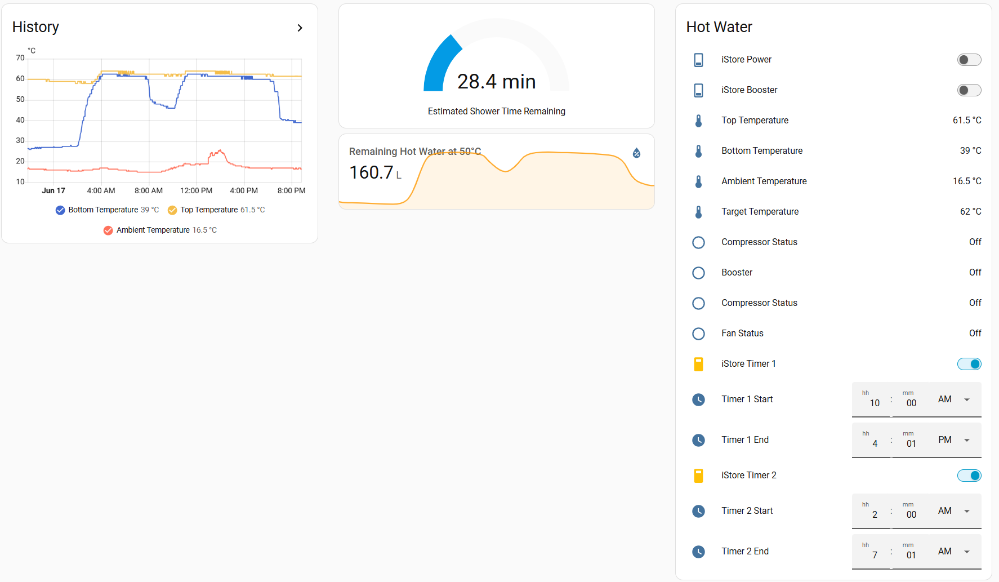

# iStore Heat Pump – Home Assistant Custom Integration

A Home Assistant custom integration for iStore Hot Water System (R290).
Provides full monitoring + control using the official iStore API. This integration can only be used with the iStore Heat Pumps system that has already fitted in the wifi module, and able to connect with the Univers EMS mobile app. Most iStore Hot Water System that installed posted November 2025 should comes with the wifi module. 

### Sample of Home Assistant Dashboard

## Features

### Live Monitoring
- Top temperature  
- Bottom temperature  
- Target temperature  
- TargetMin & TargetMax  
- Ambient / Coil / Suction temperature  
- Compressor status  
- System running state  
- Booster state  
- Work mode (Eco / Boost / Hybrid / etc.)  
- Timer 1 and Timer 2 schedules  
  - Enabled / disabled  
  - On / Off time  

---

## Full Control
- Power ON/OFF  
- Booster ON/OFF  
- Set Timers ON/OFF
- Change Timer Start / Stop times
---

## Installation

### Manual Install

1. Copy the **istore_heatpump** folder into:
/config/custom_components/istore_heatpump/

2. Restart Home Assistant

3. Go to:
Settings → Devices & Services → Add Integration → “iStore Heat Pump”

---

## Configuration

Add the username and password you use to login to https://home.istore.net.au/hossain-fe/index.html?login
Update / override the other options such as tempering valve temp (if you have a tempering valve installed for example to limit hot water to 50'), shower temp, and assumed cold water temp (these are used for calculation of remaining hot water and shower time)

Note if you change your password in the iStore portal, you can update the password in the integration to match.

---

## Sensors
| Entity | API Point | Description |
|--------|-----------|-------------|
| sensor.istore_top_temperature | WH.TopTemp | Tank top temperature |
| sensor.istore_bottom_temperature | WH.BottomTemp | Tank bottom temperature |
| sensor.istore_target_temperature | WH.TargetTemp | Current target temperature |
| sensor.istore_target_temperature_min | WH.TargetTempMin | Minimum target limit |
| sensor.istore_target_temperature_max | WH.TargetTempMax | Maximum target limit |
| sensor.istore_ambient_temperature | PUB_WH.EnvirTemp | Ambient temperature |
| sensor.istore_coil_temperature | PUB_WH.CoilTemp | Coil temperature |
| sensor.istore_suction_temperature | PUB_WH.SuctionTemp | Suction temperature |
| sensor.istore_compressor_status | PUB_WH.CompressorStatus | Compressor on/off |
| sensor.istore_booster_state | PUB_WH.Booster | Booster state (1=On, 2=Off) |
| sensor.istore_work_mode | PUB_WH.WorkMode | Work mode (Eco, Boost, Hybrid, etc.) |
| sensor.istore_timer1_on | PRI_RE_WH.Timer1On | Timer 1 enabled |
| sensor.istore_timer1_on_time | PRI_RE_WH.Timer1OnTime | Timer 1 ON time |
| sensor.istore_timer1_off | PRI_RE_WH.Timer1Off | Timer 1 disabled |
| sensor.istore_timer1_off_time | PRI_RE_WH.Timer1OffTime | Timer 1 OFF time |
| sensor.istore_timer2_on | PRI_RE_WH.Timer2On | Timer 2 enabled |
| sensor.istore_timer2_on_time | PRI_RE_WH.Timer2OnTime | Timer 2 ON time |
| sensor.istore_timer2_off | PRI_RE_WH.Timer2Off | Timer 2 disabled |
| sensor.istore_timer2_off_time | PRI_RE_WH.Timer2OffTime | Timer 2 OFF time |

---

## Notes

- Since this is using iStore API to control the hot water system, it will take up to 15 seconds for any changes (eg. On/Off, change temperature, Booster etc.)
- Sensor data are updated every 30 seconds

---

## Disclaimer

This is a community-built integration and is not affiliated with iStore.
Use at your own risk.

